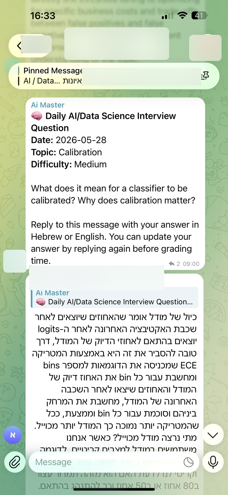
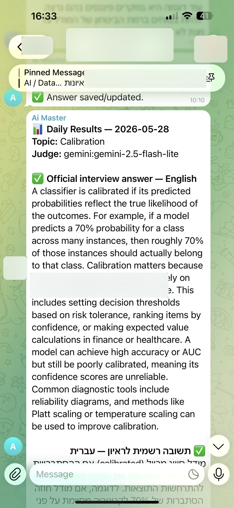

# AI Interview Coach Telegram Bot

A production-style Telegram bot for daily AI/Data Science interview practice in study groups.

The bot posts one interview question every day, collects participant answers by reply, grades the answers with either a deterministic rubric or an LLM judge, and publishes an end-of-day report with an official answer and participant feedback.

<p align="center">
  
  
</p>

> Demo screenshots are anonymized. Group names and participant names are blurred.

## Why this project exists

Interview preparation usually fails because practice is inconsistent and feedback arrives too late. This project turns a Telegram group into a lightweight daily training environment: every participant gets the same question, answers in Hebrew or English, and receives ranked feedback at grading time.

## Features

- Daily AI/Data Science interview questions
- Telegram group activation with `/activate`
- Question posting with `/today`
- Answer collection by replying directly to the bot message
- Manual answer submission with `/answer`
- End-of-day grading with `/grade`
- Weekly/all-time leaderboard with `/leaderboard`
- Local deterministic rubric grader for free development
- Optional Gemini LLM judge for higher-quality feedback
- Multilingual Hebrew/English answer support
- Curated question bank with interview topics
- FastAPI health/status API
- Docker deployment
- DigitalOcean-friendly setup

## Architecture

```text
Telegram Group
    ↓
aiogram Bot Handlers
    ↓
SQLAlchemy Persistence Layer
    ↓
Question Bank + Answer Storage
    ↓
Local Rubric Grader or Gemini LLM Judge
    ↓
Daily Results Report + Leaderboard
    ↓
FastAPI Health / Status API
```

## Tech Stack

- Python
- aiogram 3
- FastAPI
- SQLAlchemy
- APScheduler
- SQLite for local deployment
- PostgreSQL-compatible `DATABASE_URL` for production
- Docker / Docker Compose
- Optional Gemini LLM grading

## Telegram Commands

| Command | Description |
|---|---|
| `/activate` | Activate the current Telegram group |
| `/today` | Post today’s interview question immediately |
| `/answer ...` | Submit or update an answer manually |
| `/grade` | Grade today’s answers and publish the report |
| `/leaderboard` | Show participant ranking |
| `/whoami` | Show your Telegram user ID for admin config |
| `/help` | Show command help |

## Quickstart

### 1. Create a Telegram bot

1. Open Telegram and message `@BotFather`.
2. Run `/newbot`.
3. Copy the bot token.
4. Add the bot to your Telegram study group.
5. In the group, run `/activate`.

Recommended usage: participants reply directly to the daily question message. Telegram bots can receive replies to their own messages even when privacy mode is enabled.

### 2. Run locally

```bash
python -m venv .venv
source .venv/bin/activate  # Windows: .venv\\Scripts\\activate
pip install -r requirements.txt
cp .env.example .env
```

Edit `.env`:

```env
BOT_TOKEN=your_telegram_bot_token_here
DATABASE_URL=sqlite:///./data/interview_bot.db
TIMEZONE=Asia/Jerusalem
GRADING_PROVIDER=local
```

Start the bot and API:

```bash
python -m app.main
```

Check the API:

```bash
curl http://localhost:8000/health
curl http://localhost:8000/status
```

### 3. Run with Docker Compose

```bash
cp .env.example .env
# edit .env and set BOT_TOKEN

docker compose up -d --build

docker compose logs -f interview-bot
```

Health check:

```bash
curl http://localhost:8000/health
```

## LLM Grading

The project supports two grading modes.

### Local grading

```env
GRADING_PROVIDER=local
```

This is free, deterministic, and useful for testing.

### Gemini grading

```env
GRADING_PROVIDER=gemini
GEMINI_API_KEY=your_key
GEMINI_MODEL=gemini-2.5-flash-lite
```

Gemini grading sends all answers from the same daily question in one batch request, which reduces cost compared with grading each participant separately. If the LLM request fails, the system falls back to local grading.

## Scheduling

Default schedule uses `Asia/Jerusalem`:

```env
DAILY_QUESTION_HOUR=9
DAILY_QUESTION_MINUTE=0
DAILY_GRADE_HOUR=21
DAILY_GRADE_MINUTE=0
```

## Question Bank

Questions live in:

```text
question_bank/seed_questions.json
```

Each question includes:

- external ID
- topic
- difficulty
- question text
- model answer
- expected rubric points
- multilingual keyword hints

The database is seeded automatically when the app starts.

## API

### `GET /health`

Returns:

```json
{"status": "ok"}
```

### `GET /status`

Returns runtime counters such as active chats, users, questions, answers, grades, and average score.

## Deployment Notes

This project was designed to run on a small always-on VPS such as a DigitalOcean droplet.

For production, use:

- Docker Compose
- `.env` for secrets
- persistent `data/` volume for SQLite, or PostgreSQL for stronger persistence
- `ADMIN_TELEGRAM_USER_IDS` to restrict grading/admin commands
- reverse proxy only if you want to expose the FastAPI status endpoints publicly

See [`DEPLOYMENT.md`](DEPLOYMENT.md) and [`docs/GIT_REPO_GUIDE.md`](docs/GIT_REPO_GUIDE.md).

## Security and Privacy

Do not commit:

- `.env`
- bot tokens
- Gemini API keys
- SQLite database files
- real Telegram chat IDs
- real Telegram user IDs
- screenshots with visible private names

The demo screenshots in this repository are anonymized.

## Repository Status

This is an MVP-to-production style project. It already runs as a real Telegram bot, while leaving clear upgrade paths:

- PostgreSQL migration support
- webhook-based deployment
- richer grading rubrics
- per-topic analytics
- spaced repetition question scheduling
- admin dashboard
- exported participant progress reports

## License

MIT
